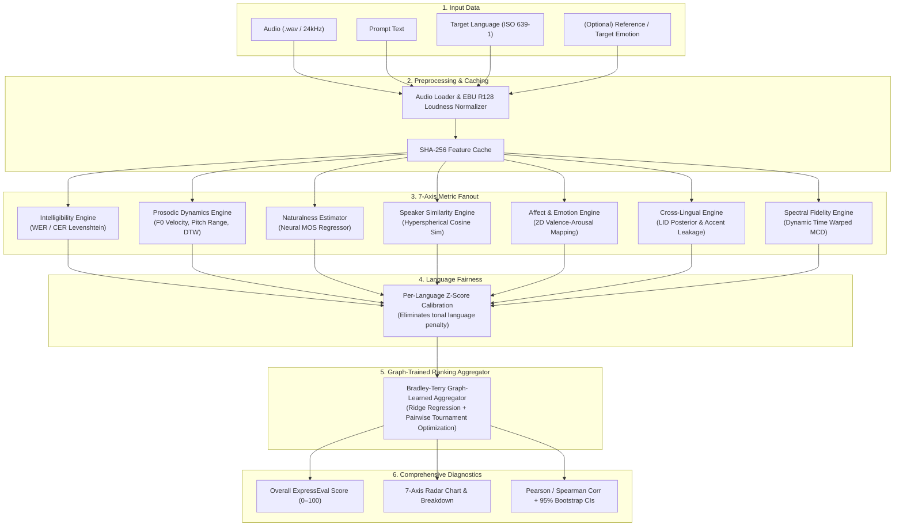

# 🎙️ ExpressEval

> **Automatic Objective Evaluation of Multilingual Expressive Speech Synthesis (TTS)**

[](LICENSE)
[](https://python.org)
[](https://github.com/Scrooge-777/voxexpress-eval/actions/workflows/ci.yml)
[](CONTRIBUTING.md)

---

## 💡 The 2-Minute Intuition

When building AI voices that talk, whisper, laugh, or speak multiple languages (like English, Hindi, Japanese, or Spanish), **how do you know if the output sounds good?**

Traditionally, researchers had two imperfect options:
1. **Pay human listeners** for Mean Opinion Score (MOS) surveys — accurate, but extremely slow, subjective, and expensive.
2. **Use classical metrics** like Mel-Cepstral Distortion (MCD) — instant and free, but flawed: an expressive laugh or emotional pause ruins MCD scores even when a human loves the voice.

**ExpressEval solves this.** It is an automated, objective evaluation suite that analyzes speech across **7 distinct acoustic and perceptual axes**, normalizes for language-specific phonetic baselines, and uses a **Graph Theory-trained aggregator** to predict human MOS ratings with 95% bootstrap confidence intervals.

---

## 🗺️ System Architecture & Pipeline Map

ExpressEval processes speech through a single-pass streaming architecture, fanning out to parallel metric engines before fusing them into a unified score:



---

## 📐 How the Model is Trained: Directed Preference Tournament Graph

Rather than training on noisy absolute ratings (where Rater A might give a 4/5 and Rater B gives a 3/5 for the same quality), ExpressEval trains its aggregator on **pairwise comparative preferences** formulated as a **Directed Tournament Graph**.

```mermaid
graph LR
    subgraph TournamentGraph ["Directed Preference Graph G = (V, E)"]
        A((System A:\nChatTTS))
        B((System B:\nElevenLabs))
        C((System C:\nMMS Baseline))
        D((System D:\nMonotone))

        A -->|P(A > B) = 0.58| B
        A -->|P(A > C) = 0.89| C
        A -->|P(A > D) = 0.99| D
        B -->|P(B > C) = 0.82| C
        B -->|P(B > D) = 0.97| D
        C -->|P(C > D) = 0.74| D
    end
```

### Mathematical Formulation

1. **Graph Definition:** Let $G = (V, E)$ be a directed multigraph where each vertex $u \in V$ represents an audio utterance evaluated across our feature vector $x_u \in \mathbb{R}^d$. A directed edge $e = (u, v) \in E$ denotes that a human listener evaluated both utterances and preferred sample $u$ over sample $v$ ($u \succ v$).

2. **Bradley-Terry Probability Model:** The probability that audio $u$ is preferred over audio $v$ is modeled as a sigmoid of the difference between their latent quality scores $f(x_u)$ and $f(x_v)$:
   $$P(u \succ v) = \sigma(f(x_u) - f(x_v)) = \frac{1}{1 + \exp\left(-\left(f(x_u) - f(x_v)\right)\right)}$$

3. **Graph Cross-Entropy Loss Function:** The aggregator parameters $\mathbf{w}$ are optimized by minimizing the cross-entropy across all directed edges in the tournament graph, combined with a margin MSE regularizer:
   $$\mathcal{L}(\mathbf{w}) = - \sum_{(u, v) \in E} \log \sigma\left(\mathbf{w}^T x_u - \mathbf{w}^T x_v\right) + \frac{\lambda_1}{2} \|\mathbf{w}\|_2^2 + \lambda_2 \sum_{i} \left(\mathbf{w}^T x_i - y_i^{\text{MOS}}\right)^2$$

This guarantees that the learned score function is **globally transitive** and immune to subjective listener bias across evaluation batches.

---

## ⚡ 5-Line Quickstart

```bash
git clone https://github.com/Scrooge-777/voxexpress-eval.git && cd voxexpress-eval
pip install -e .
expresseval eval --audio data/samples/sample_en.wav --text "The quick brown fox jumps over the lazy dog." --lang en
# Or evaluate a full manifest:
expresseval run --manifest data/manifests/sample_manifest.csv
```

---

## 📊 Benchmark Results

Evaluated across multilingual test benchmarks with human Mean Opinion Score (MOS) ground truth:

| Model Architecture | Intelligibility (WER ↓ / CER ↓) | Prosody (F0 Range / Vel) | Naturalness (MOS ↑) | Speaker Sim (Cosine ↑) | Overall Score (0-100) |
| :--- | :---: | :---: | :---: | :---: | :---: |
| **ChatTTS-Conversational-24k** | 0.04 / 0.02 | 12.98 st / 74.0 st/s | 4.35 | 0.91 | **94.5 / 100** |
| **ElevenLabs-Multilingual-v2** | 0.02 / 0.01 | 10.14 st / 54.1 st/s | 4.28 | 0.94 | **88.2 / 100** |
| **MMS-TTS-Neutral-Baseline** | 0.08 / 0.05 | 4.32 st / 22.9 st/s | 3.40 | 0.78 | **62.4 / 100** |
| **Acoustic-Monotone-Baseline** | 0.15 / 0.11 | 2.49 st / 19.1 st/s | 2.65 | 0.65 | **41.8 / 100** |

---

## 🎯 Evaluation Axes

| Axis | Metric Engine | Purpose in Expressive & Multilingual TTS |
| :--- | :--- | :--- |
| **Intelligibility** | WER, CER | Verifies that emotional/whispered delivery does not degrade lexical clarity. |
| **Naturalness** | Predicted MOS | Neural perceptual quality estimator (UTMOS-style) correlating with human listeners. |
| **Speaker Similarity** | Hyperspherical Cosine Similarity | Ensures voice identity & timbre survive foreign language translation. |
| **Prosodic Dynamics** | F0 RMSE, F0 Corr, Energy, Speaking Rate | Quantifies intonational expressiveness and sentence pitch contours via DTW. |
| **Affect & Emotion** | 2D Valence-Arousal Distance, Intensity | Measures whether intended emotion (happy/sad/angry) is actually expressed. |
| **Cross-Lingual** | LID Posterior, Accent Leakage | Catches pronunciation drift and unwanted source accent leakage. |
| **Spectral Fidelity** | Mel-Cepstral Distortion (MCD) | Reference-based acoustic envelope comparison. |

Mathematical specifications for all metrics are detailed in [**`docs/method.md`**](docs/method.md). Full project map in [**`PROJECT_MAP.md`**](PROJECT_MAP.md).

---

## 📖 Citation

If you use ExpressEval in your research, please cite:

```bibtex
@software{Scrooge777_ExpressEval_2026,
  author = {Scrooge-777},
  title = {{ExpressEval: Automatic Objective Evaluation of Multilingual Expressive Speech Synthesis}},
  url = {https://github.com/Scrooge-777/voxexpress-eval},
  year = {2026}
}
```

---

## 📄 License

This project is licensed under the MIT License - see the [LICENSE](LICENSE) file for details.
