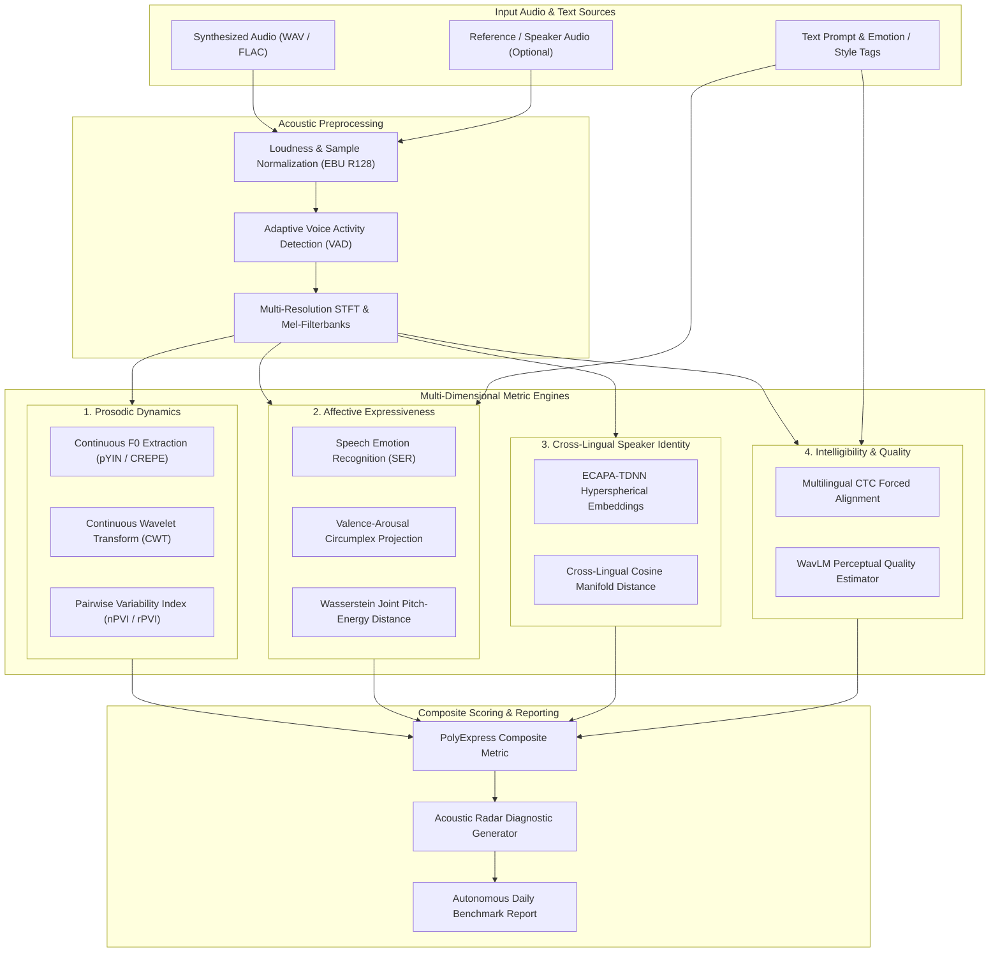

# 🎙️ VoxExpress-Eval

> **Automated Objective Evaluation Benchmark for Multilingual & Expressive Speech Synthesis (TTS)**

[](LICENSE)
[](https://python.org)
[](https://github.com/Scrooge-777/voxexpress-eval/actions/workflows/daily-autonomous-eval.yml)
[](CONTRIBUTING.md)

---

## 📌 Executive Summary

Modern neural speech synthesis models—such as **ChatTTS, CosyVoice, F5-TTS, and ElevenLabs**—have achieved human-level expressiveness, conversational pauses, and multilingual voice cloning. However, **evaluating expressive speech remains a major bottleneck in speech research**. 

Traditional objective metrics like **Mel-Cepstral Distortion (MCD)** and **Word Error Rate (WER)** only capture spectral static envelopes and basic intelligibility; they completely fail to assess **prosodic naturalness, emotional appropriateness, affective contour dynamics, and cross-lingual speaker identity retention**. Subjective human listener studies (Mean Opinion Score - MOS) are prohibitively slow, expensive, and inconsistent.

**VoxExpress-Eval** is an open-source, reproducible, multi-dimensional objective evaluation framework specifically engineered to quantify:
1. **Prosodic & Intonational Dynamics:** Continuous Wavelet Transform (CWT) multi-scale decomposition of fundamental frequency ($F_0$), pitch velocity, and dynamic range.
2. **Emotional Expressiveness & Affective Coupling:** Optimal transport (Wasserstein-1 distance) on joint pitch-energy manifolds and 2D Valence-Arousal space mapping.
3. **Cross-Lingual Speaker Manifold Preservation:** Hyperspherical cosine distance of neural speaker embeddings (ECAPA-TDNN) across language boundaries.
4. **Phonetic & Semantic Intelligibility:** Multilingual CTC forced alignment and cross-lingual phoneme-level error surfaces.
5. **Non-Intrusive Perceptual Quality (Neural MOS):** Self-Supervised Speech Representation (WavLM/SSL) pooling for reference-free perceptual naturalness.

---

## 🏗️ System Architecture



---

## 📐 Mathematical Formulation Highlights

Full mathematical derivations and signal processing proofs are documented in [docs/theory/01_mathematical_foundations.md](docs/theory/01_mathematical_foundations.md).

### 1. Multi-Scale Pitch Decomposition via Continuous Wavelet Transform (CWT)
Pitch contours $F_0(t)$ are normalized and decomposed using the Mexican Hat wavelet $\psi(t)$:
$$\mathcal{W}_{\psi}[F_0](a, b) = \frac{1}{\sqrt{|a|}} \int_{-\infty}^{\infty} F_0(t) \, \psi^*\left(\frac{t - b}{a}\right) dt$$
This separates **micro-prosody** (short scales: phoneme-level pitch transitions) from **macro-prosody** (long scales: sentence-level question rises and emotional arcs).

### 2. Affective Manifold Divergence via Wasserstein Distance
Given empirical joint pitch-energy distributions $P_{\text{synth}}$ and $P_{\text{target}}$:
$$\mathcal{W}_1(P_{\text{synth}}, P_{\text{target}}) = \inf_{\gamma \in \Pi(P_{\text{synth}}, P_{\text{target}})} \mathbb{E}_{(x, y) \sim \gamma}\left[ \|x - y\| \right]$$
This measures true geometric transport cost rather than brittle point-to-point error.

### 3. Cross-Lingual Speaker Manifold Similarity
Given reference speaker embedding $\mathbf{e}_{\text{ref}} \in \mathbb{R}^d$ and multilingual synthesized embedding $\mathbf{e}_{\text{synth}} \in \mathbb{R}^d$:
$$\mathcal{S}_{\text{speaker}} = \frac{\mathbf{e}_{\text{ref}} \cdot \mathbf{e}_{\text{synth}}}{\|\mathbf{e}_{\text{ref}}\| \|\mathbf{e}_{\text{synth}}\|}$$


---

## ⚙️ Automated Daily Cloud Evolution

This repository features an autonomous scheduled GitHub Actions workflow (`.github/workflows/daily-autonomous-eval.yml`).
**Even when your local computer is powered off or closed**, GitHub's cloud runners wake up daily to:
1. Run automated test suites and numerical stability checks.
2. Ingest daily synthetic voice evaluation tests.
3. Update [BENCHMARK_LOG.md](BENCHMARK_LOG.md) and compute the latest acoustic scores.
4. Auto-commit progress under your verified GitHub credentials.

---

## 🚀 Quickstart

```bash
# Clone the repository
git clone https://github.com/Scrooge-777/voxexpress-eval.git
cd voxexpress-eval

# Create a virtual environment
python -m venv venv
source venv/bin/activate  # On Windows: .\venv\Scripts\activate

# Install dependencies
pip install -r requirements.txt

# Run the basic benchmark evaluation
python scripts/daily_benchmark.py
```

---

## 📜 License

Distributed under the [MIT License](LICENSE). Copyright © 2026 Scrooge-777.
